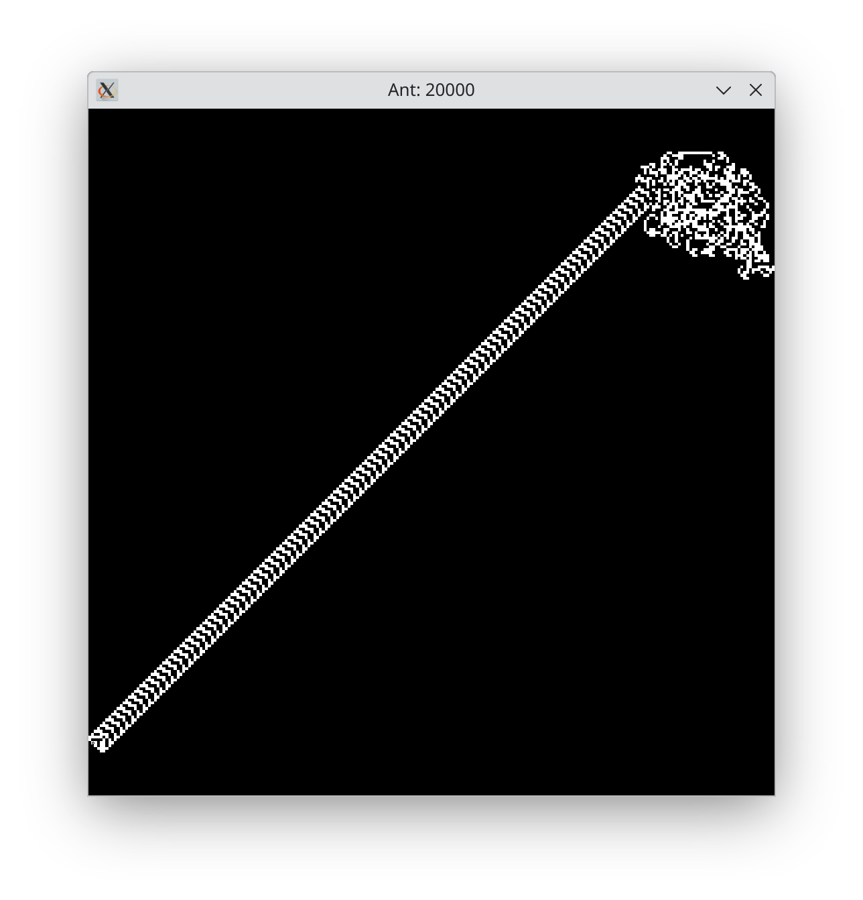
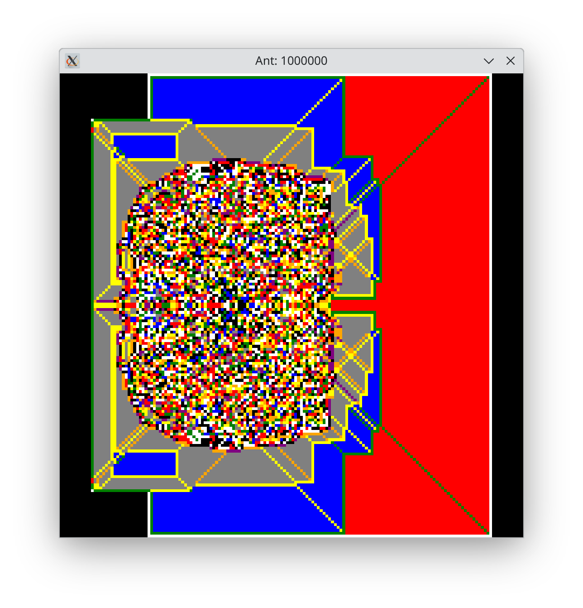
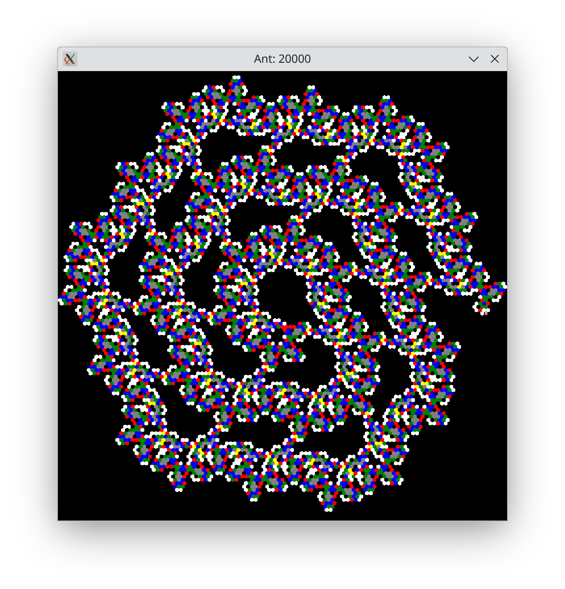
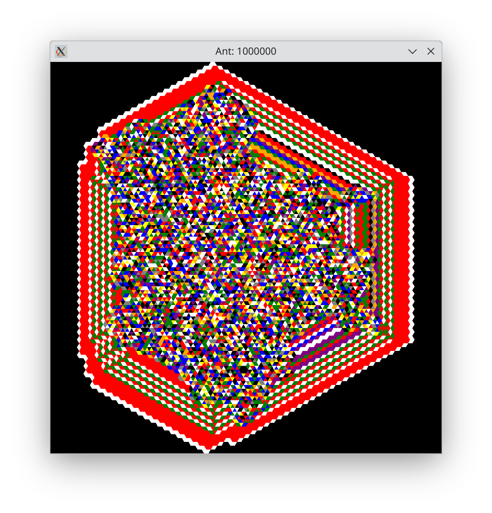

ant
===

An implementation of
[Langton's Ant](https://en.wikipedia.org/wiki/Langton%27s_ant), and the
more general [turmites](https://en.wikipedia.org/wiki/Turmite).

## Examples
### Langton's Ant
```shell
uv run pyant run RL --step-limit 20000
```


### A 12 colour ant
```shell
uv run pyant run RLLRRLLLLRRR
```


### A 7 colour ant on a hex grid
```shell
uv run pyant run --grid hex R1R2NUR2R1L2 --step-limit 20000
```


### A 14 colour ant on a triangle grid
```shell
uv run pyant run --grid triangle RLLLLLLLLLLLLL
```

